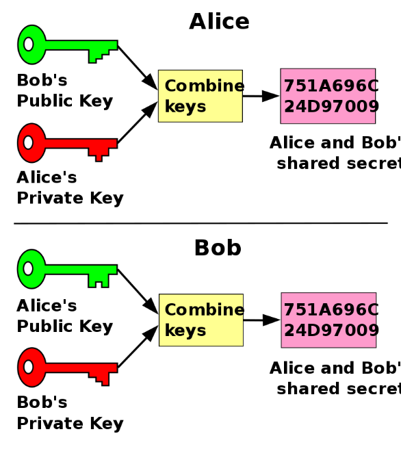
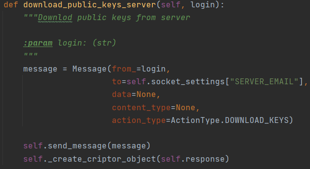
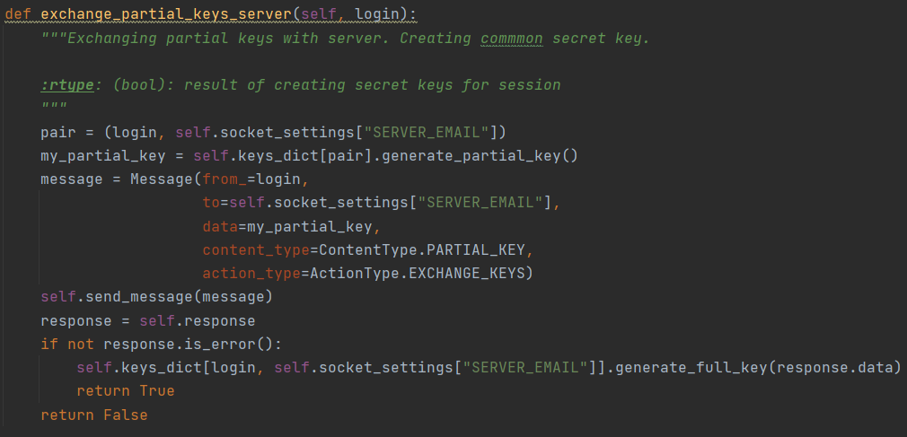
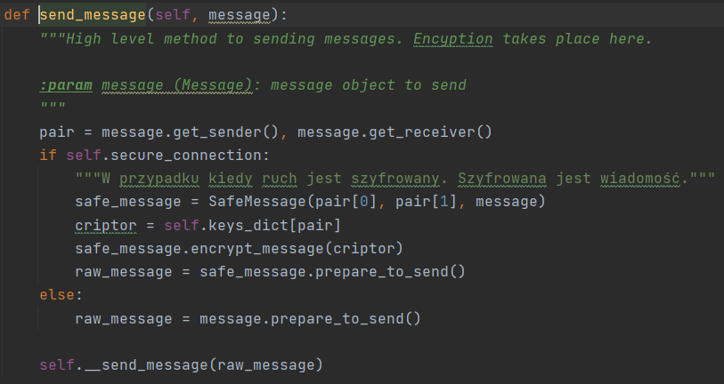

PrivChatter zadbamy o twoje bezpieczeństwo.

Instalacja: 

1.      Pobierz zawartość. 
2.      Stwórz virtual env dla projektu. 
3.      Zainstaluj wymagane zależności z pliku requirements.txt
4.      Włącz serwer. (plik run_server.py)
5.      Włącz klienta. (plik ui_backend.py w folderze user_interface)

Przykładowe dane do logowania:
1.      Login: saperpro@o2.pl
        Password: 123456789
2.      Login: test@gmail.com
        password: zaq1@WSX
Użycie:

1.      Zaloguj lub zarejestruj się.
2.      W okienku receiver mail wpisz adres odbiorcy.
3.      Przycisk odświerz ładuje wysłane przez odbiorcę wiadmości.
4.      Przycisk wyślij wysyła wiadomosć do odbiorcy.
5.      Po wylogowaniu się wszystkie wiadomości zostaną usunięte
6.      Licznik w górnym prawnym roku informuje po jakim czasie
        zostaniesz automatycznie wylogowany.
7.      Podczas przechwycenia wiadomości możliwe jest przechwycenie wyłącznie maila nadawcy oraz odbiorcy.
        Reszta danych jest zabiezpieczona 256 bitowym kluczem.

Kilka słów odemnie:

1.      Dlaczego hasło nie jest zakryte?
        Zostawiłem to z premedytacją. Przyjąłem że projekt jest w fazie rozwoju.
2.      Aktualnie baza danych trzyma hasła w czystej postaci. 
        W przyszłości zostało by to zmienione. Baza danych
        już od klienta dostawać będzie hashe haseł.
3.      Defaultowo, aplikacja włączana jest w trybie debug. Tak aby można było wyświetlić na aplikacji 
        logi. Zmienić to można poprzez zmiane wartości True na False w pliku ui_backend.py w mainie. 

4.      Django jest użyte tylko w celu wykrzystania ich ORM. 

Szyfrowanie jest zaimplementowane na podstawie algorytmu Diffie–Hellman key exchange.

Ustanowienie szyfrowanego połączenia:
1.       Pobranie klucza publicznego w postaci wartości P oraz G. 
   
2.       Wymiana częściowymi kluczami oraz stworzenie klucza prywatnego.
   
3.       Od teraz komunikacja jest zaszyfrowana. 
         Każda para posiada swój unikatowy klucz prywatny.
         W momęcie gdy ktoś próbować będzie się podszyć. 
         Serwer nie będzie w stanie odszyfrować wiadomości. 
         Co poskutkuje brakiem reakcji. 
   
4.       Po stronie serwera występuje bardzo podobny proces. 
5.       Na koniec każda para posiada swój unikatowy klucz prywatny oraz wspólny klucz pod nazwą secret_key.
         Szyfrowanie oraz deszyfrowanie odbywa się za pomocą secret_key. 
         Bez jego znajomości nie możliwe jest podszycie się. 
6.       Nowe klucze są tworzone w momęcie logowania się.
